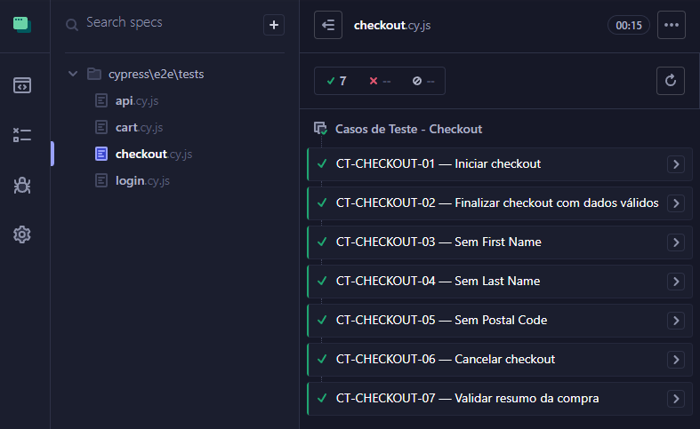

[](https://github.com/prismotta/qa-automation-cypress/actions)

# QA Automation - Cypress

Projeto de automação de testes E2E e API utilizando Cypress com padrão Page Object Model.

## Demonstração da execução dos testes

Abaixo está um exemplo da execução automatizada dos cenários de checkout.



---

## Objetivo do Projeto

Este projeto foi desenvolvido com o objetivo de praticar automação de testes E2E e API utilizando Cypress, aplicando boas práticas como Page Object Model, organização de cenários de teste, rastreabilidade e integração contínua com GitHub Actions.

---

## Tecnologias Utilizadas

- Cypress
- JavaScript
- Node.js
- Git
- GitHub Actions

---

## Estrutura do Projeto

```text
qa-automation-cypress
├── .github
│   └── workflows
├── assets
│   └── checkout-tests.png
├── cypress
│   └── e2e
│       ├── pages
│       └── tests
├── cypress.config.js
├── package.json
├── package-lock.json
└── README.md
```

---

## Casos Automatizados

### Login

- CT-LOGIN-01 — Login com credenciais válidas
- CT-LOGIN-02 — Login com senha inválida
- CT-LOGIN-03 — Login com campos obrigatórios em branco

### Carrinho

- CT-CART-01 — Adicionar produto ao carrinho
- CT-CART-02 — Remover produto do carrinho

### Checkout

- CT-CHECKOUT-01 — Iniciar checkout
- CT-CHECKOUT-02 — Finalizar checkout com dados válidos
- CT-CHECKOUT-03 — Checkout sem preencher First Name
- CT-CHECKOUT-04 — Checkout sem preencher Last Name
- CT-CHECKOUT-05 — Checkout sem preencher Postal Code
- CT-CHECKOUT-06 — Cancelar checkout
- CT-CHECKOUT-07 — Validar resumo da compra

### API

- GET /posts — Validação de status 200
- POST /posts — Validação de status 201
- Rota inválida — Validação de status 404

---

## Como Executar o Projeto

### Instalar as dependências

```bash
npm install
```

### Executar os testes em modo interativo

```bash
npx cypress open
```

### Executar os testes em modo headless

```bash
npx cypress run
```

---

## Aprendizados

Durante o desenvolvimento deste projeto foram aplicados conceitos de:

- Automação E2E com Cypress
- Testes de API
- Page Object Model (POM)
- Organização e rastreabilidade de casos de teste
- Integração contínua com GitHub Actions
- Estruturação de projetos de automação
- Boas práticas de manutenção e reutilização de código

---

## Observação

Este projeto replica os mesmos cenários automatizados presentes no repositório **qa-automation-python**, demonstrando conhecimento em diferentes stacks de automação:

- Cypress + JavaScript
- Selenium WebDriver + Pytest + Python

---

## Autora

**Priscila Motta**

- LinkedIn: [linkedin.com/in/prismotta](https://www.linkedin.com/in/prismotta)
- GitHub: [github.com/prismotta](https://github.com/prismotta)
